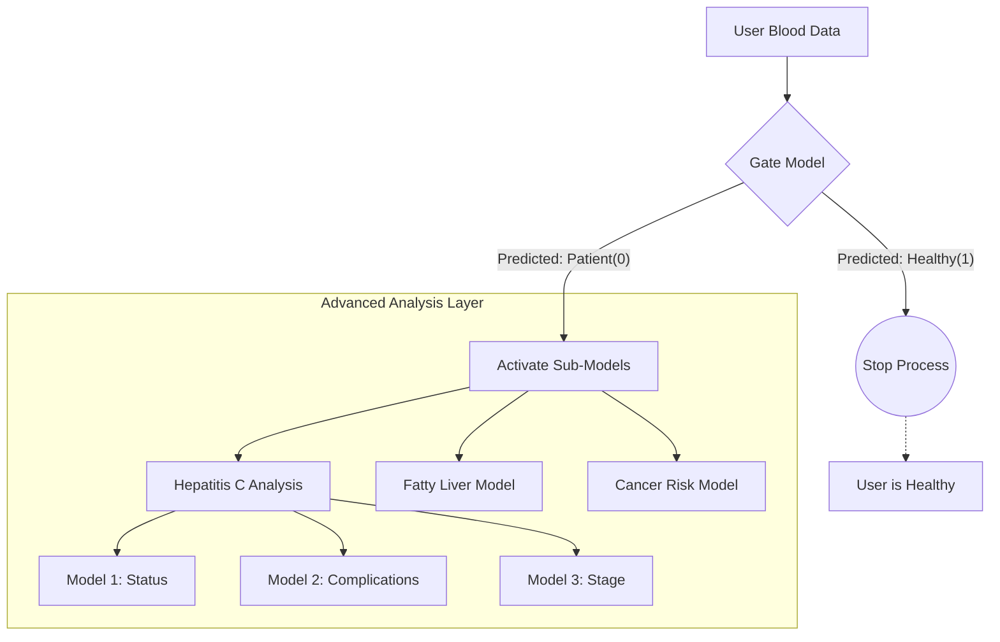

# The Gate Model

This section is dedicated to the initial triage of users, functioning as the system's "First Line of Defense." It employs a binary classification approach to distinguish between healthy individuals and potential liver patients. The system relies on an **XGBoost** training model, with its core file built as `models/gate_model.pkl`. The model analyzes biochemical input values based on "weights" acquired during the training phase on a rigorously cleaned dataset, ensuring resource efficiency by filtering out healthy users before activating complex sub-models.

---

### Dataset Overview

| Name | Database Location | Function |
| --- | --- | --- |
| **gate_model.pkl** | `models/` | The trained model containing the final decision-making weights(Sick, Healthy). |
| **train_gate_model.py** | `code/` | Source code responsible for cleaning data and training the model. Can be run directly in Google Colab |
| **test_gate_model.py** | `code/` | Source code dedicated to testing the efficiency of the trained model. Can be run directly in Google Colab |
| **Liver_Patient_Dataset_Cleaned_19k.csv** | `data/processed` | The cleaned training dataset containing ~19,000 unique records. |
| **XGBoost.md** | `docs/` | Technical documentation explaining the mechanism of the XGBoost algorithm. |

---
### Training Phase

The system's efficiency depends on a data split of **80% for training** and **20% for testing**, which resulted in a realistic real-world accuracy of **97%**.

* **Data Processing:** Unlike standard datasets, **rigorous preprocessing** was performed. Over 11,000 duplicate rows were identified and removed from the original raw file (`data/raw/Liver Pationt Dataset (LPD)_train.csv`).
* **Training Data:** The model was trained on data from approximately **15,500 patients** extracted from the `Liver_Patient_Dataset_Cleaned_19k.csv` file.
* **Testing Data:** Data from approximately **3,800 patients** was reserved to test the accuracy and validity of the model on unseen data.

> This split adheres to the "Golden Standard" for building a robust "Smart System." Crucially, this model was trained on a **de-duplicated dataset** (reduced from 30k to 19k rows) to prevent "Data Leakage" and ensure the model learns actual patterns rather than memorizing repeated entries (for more info about ML: `docs/XGBoost.md`).

---

### 1- Data Source and Integrity

* **Original Database:** Retrieved from the "Liver Disease Patient Dataset" on **Kaggle**, curated by **Abhishek Shrivastav** (2018).
* **Data Link:** [Source on Kaggle](https://www.kaggle.com/datasets/abhi8923shriv/liver-disease-patient-dataset)
* **Data Transformation:** The raw training file (`data/raw/Liver Pationt Dataset (LPD)_train.csv`) was processed and transformed into the final optimized dataset (`data/processed/Liver_Patient_Dataset_Cleaned_19k.csv`) used to train this model.

---

### 2- Model Input Requirements

To ensure result accuracy, data must be entered in the strict mathematical order used during model training:
`['Age', 'Gender', 'Total_Bilirubin', 'Direct_Bilirubin', 'Alkaline_Phosphotase', 'Alamine_Aminotransferase', 'Aspartate_Aminotransferase', 'Total_Protiens', 'Albumin', 'Albumin_and_Globulin_Ratio']`

---

## Gateway Architecture 

The system is designed with a **resource-efficient workflow**. Instead of running all diagnostic models (HepatitisC 3-models and Fatty Liver, Cancer) simultaneously—which consumes processing power espetially if were added more models in future*—the Gate Model acts as a smart filter.

### How it Works:
1.  **Screening:** The user's data is first processed *only* by the Gate Model.
2.  **Decision Making:**
    * **If Healthy(1):** The workflow terminates immediately. No further analysis is needed. This ensures **zero unnecessary computation**.
    * **If Patient(0):** The system recognizes a risk and *only then* activates the secondary specialized models to diagnose the specific condition.

> This "Conditional Computation" approach ensures that the application remains lightweight and fast, saving device battery and server resources by preventing the execution of complex models on healthy users.

---

## Logic Flowchart

---

# Gate Model Testing & Validation

To ensure the reliability of the **Gate Model** as the primary screening layer, it was subjected to a rigorous "Stress Test" using 10 synthetic medical cases designed to mimic real-world scenarios. These cases range from clearly healthy individuals to critical patients, including complex "borderline" cases to test the model's sensitivity.

## 1. Test Data Overview
The testing dataset consists of **10 distinct profiles** with varying biochemical markers.
* test_gate_model.py inside `code/`, ore 

### Cases Medical Analysis of The 10 Cases

| Case ID | Condition | Key Medical Indicators (Why?) |
| :---: | :--- | :--- |
| **1** |  **Sick** | **High Bilirubin (8.5)** & Elevated Enzymes (SGPT 200). Classic Jaundice signs. |
| **2** |  **Sick** | **Very Low Albumin (1.8)** & Inverted A/G Ratio (0.50). Indicates chronic liver dysfunction. |
| **3** |  **Sick** | **Extreme Bilirubin (15.0)** & High Alkphos (550). Signs of acute hepatitis |
| **4** |  **Sick** | **SGOT > SGPT** (250 vs 80). A classic pattern often associated with Alcoholic Liver Disease. |
| **5** | **Sick** | Moderate enzyme elevation (SGPT 150) & **Fatty Liver** indicators. |
| **6** |  **Sick** | **Elderly Patient (75)** with critical enzyme levels and low proteins. |
| **7** |  **Healthy** | All values are within the standard reference ranges for a young adult. |
| **8** |  **Borderline** | **Slightly elevated Alkaline Phosphotase (180).** Medically ambiguous, but the model flags it as "Risk". |
| **9** |  **Borderline** | **Senior (65)** with Alkphos (195). The model chooses safety (Sick). |
| **10** | **Healthy** | Perfect blood work. Young individual (18) with optimal liver function. |

*The medical descriptions provided are illustrative summaries derived from publicly available clinical reference ranges and were generated with the assistance of large language models for documentation clarity only. They do not represent medical diagnosis or professional medical judgment.*

---

## 2. Model Predictions & Output Analysis

The following table shows the actual raw output from the model (`0=Sick` or `1=Healthy`) and the interpretation.

| Case | Raw Output | Diagnosis | Medical Expectation | Result Status |
| :---: | :---: | :--- | :--- | :--- |
| **1** | `0` | Liver Patient | **Sick** |  **PASS** |
| **2** | `0` | Liver Patient | **Sick** |  **PASS** |
| **3** | `0` | Liver Patient | **Sick** |  **PASS** |
| **4** | `0` | Liver Patient | **Sick** |  **PASS** |
| **5** | `0` | Liver Patient | **Sick** |  **PASS** |
| **6** | `0` | Liver Patient | **Sick** |  **PASS** |
| **7** | `1` | Healthy | **Healthy** |  **PASS** |
| **8** | `0` | Liver Patient | *Borderline / High Normal* |**Safety Trigger** |
| **9** | `0` | Liver Patient | *Borderline / Elderly* | **Safety Trigger** |
| **10** | `1` | Healthy | **Healthy** |**PASS** |

* PASS: This label indicates that the model output is consistent with the internal design logic of the Gate Model. Clearly normal"Healthy" and clearly abnormal"Sick" cases were classified directly.

* Safety Trigger : For borderline cases (Cases 8 & 9), instead of treating near-threshold values as normal, the model intentionally applies a conservative bias and classifies them as Sick to avoid early exclusion from the analytical pipeline.

> The Gate Model is main objective is to minimize false negatives by forwarding ambiguous cases to more advanced analysis layers, even if this results in a higher number of false positives at the initial stage.

---

### Numerical Context of the Test Cases

The evaluated cases are based on a synthetic dataset of 10 profiles, each represented by numerical vectors capturing **age, gender, bilirubin levels, liver enzymes, and protein indicators**. The key numerical patterns influencing the Gate Model behavior can be as follows:

#### A- Borderline Case Handling (Cases 8 & 9)

In screening-oriented systems, **Sensitivity** is prioritized to reduce the risk of missing potentially abnormal cases.
Cases 8 & 9 were designed as *borderline profiles*, mainly due to **slightly elevated Alkaline Phosphatase (~180–195)**.
The Gate Model applies a **conservative strategy**, classifying near-threshold cases as `0` (Sick) to avoid false negatives and forward them to downstream analysis layers.
This behavior is **intentional and design-driven**, not a classification error.

#### B- Positive Detection Performance (Cases 1–6)

The model showed **high sensitivity** in detecting clearly abnormal patterns, including:

* Extreme Bilirubin and enzyme elevations (Cases 1 & 3),
* Low Albumin and inverted A/G ratio (Case 2),
* Distinct SGOT > SGPT patterns (Case 4),
* Age-weighted risk combined with protein degradation (Case 6).

These results confirm that the Gate Model evaluates **feature interactions** rather than isolated values.

#### C- System-Level Risk Interpretation

The Gate Model functions as a **risk-filtering layer**, not a diagnostic tool.
Its primary objective is to **minimize false negatives**, even if this increases false positives at the initial stage.
This conservative bias aligns with safety-first principles in high-risk systems.

#### D- Healthy Case Detection (Cases 7 & 10)

Clearly normal cases were correctly identified based on values within standard reference ranges.
By classifying these profiles as `1` (Healthy), the model triggered an **early exit**, preventing unnecessary downstream computation and validating the efficiency of the pipeline.

> For more details, see `test_gate_model.py` inside `code/` or 
---
*The medical descriptions provided are illustrative summaries derived from publicly available clinical reference ranges and were generated with the assistance of large language models for documentation clarity only. They do not represent medical diagnosis or professional medical judgment.*

---
