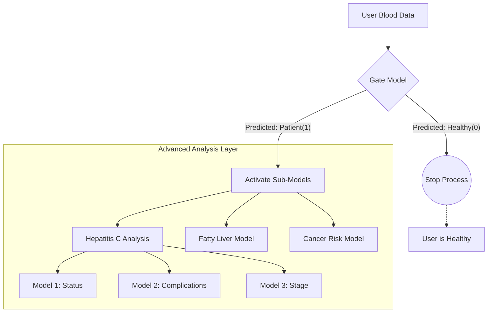

# The Gate Model

This section is dedicated to the initial triage of users, functioning as the system's "First Line of Defense." It employs a binary classification approach to distinguish between healthy individuals and potential liver patients. The system relies on an **XGBoost** training model, with its core file built as `models/gate_model.pkl`. The model analyzes biochemical input values based on "weights" acquired during the training phase on a rigorously cleaned dataset, ensuring resource efficiency by filtering out healthy users before activating complex sub-models.

---

### Dataset Overview

| Name | Database Location | Function |
| --- | --- | --- |
| **gate_model.pkl** | `models/` | The trained model containing the final decision-making weights(Sick, Healthy). |
| **train_gate_model.py** | `notebooks/code/` | Source code responsible for cleaning data and training the model. Can be run directly in Google Colab |
| **test_gate_model.py** | `notebooks/code/` | Source code dedicated to testing the efficiency of the trained model. Can be run directly in Google Colab |
| **Liver_Patient_Dataset_Cleaned_19k.csv** | `data/processed` | The cleaned training dataset containing ~19,000 unique records. |
| **XGBoost.md** | `docs/` | Technical documentation explaining the mechanism of the XGBoost algorithm. |

---
### Training Phase

The system's efficiency depends on a data split of **80% for training** and **20% for testing**, which resulted in a realistic real-world accuracy of **98.90%**. The model was trained on the 'Result' column within the training dataset—which categorizes the patient's status as either 'Sick' or 'Healthy'. This target variable was used to validate the model's performance, ensuring it identifies patterns accurately rather than simply memorizing data through a process known as Supervised Learning

* **Data Processing:** Unlike standard datasets, **rigorous preprocessing** was performed. Over 11,000 duplicate rows were identified and removed from the original raw file (`data/raw/Liver Pationt Dataset (LPD)_train.csv`).
* **Training Data:** The model was trained on data from approximately **15,500 patients** extracted from the `Liver_Patient_Dataset_Cleaned_19k.csv` file.
* **Testing Data:** Data from approximately **3,800 patients** was reserved to test the accuracy and validity of the model on unseen data.

> This split adheres to the "Golden Standard" for building a robust "Smart System." Crucially, this model was trained on a **de-duplicated dataset** (reduced from 30k to 19k rows) to prevent "Data Leakage" and ensure the model learns actual patterns rather than memorizing repeated entries (for more info about ML: `docs/XGBoost.md`).

> **Note on Final Model Deployment:** The 80/20 train-test split was utilized strictly during the validation phase to evaluate real-world generalization and performance metrics. Following verification, the final serialized model (`.pkl`) was retrained on **100% of the cleaned dataset (~19,000 records)** to maximize statistical coverage and feature weight stability for real-world inference.
---

### 1- Data Source and Integrity

* **Original Database:** Retrieved from the "Liver Disease Patient Dataset" on **Kaggle**, curated by **Abhishek Shrivastav** (2018).
* **Data Link:** [Source on Kaggle](https://www.kaggle.com/datasets/abhi8923shriv/liver-disease-patient-dataset)
* **Data Transformation:** The raw training file (`data/raw/Liver Pationt Dataset (LPD)_train.csv`) was processed and transformed into the final optimized dataset (`data/processed/Liver_Patient_Dataset_Cleaned_19k.csv`) used to train this model.

---

### 2- Model Input Requirements

To ensure result accuracy, data must be entered in the strict mathematical order used during model training:
`['Age', 'Gender', 'Total_Bilirubin', 'Direct_Bilirubin', 'Alkaline_Phosphotase', 'Alamine_Aminotransferase', 'Aspartate_Aminotransferase', 'Total_Protiens', 'Albumin', 'Albumin_and_Globulin_Ratio']`

---

## Gateway Architecture 

The system is designed with a **resource-efficient workflow**. Instead of running all diagnostic models (HepatitisC 3-models and Fatty Liver, Cancer) simultaneously—which consumes processing power espetially if were added more models in future*—the Gate Model acts as a smart filter.

### How it Works:
1.  **Screening:** The user's data is first processed *only* by the Gate Model.
2.  **Decision Making:**
    * **If Healthy(0):** The workflow terminates immediately. No further analysis is needed. This ensures **zero unnecessary computation**.
    * **If Patient(1):** The system recognizes a risk and *only then* activates the secondary specialized models to diagnose the specific condition.

> This "Conditional Computation" approach ensures that the application remains lightweight and fast, saving device battery and server resources by preventing the execution of complex models on healthy users.

---

## Diagnostic Pipeline Architecture

```mermaid
graph TD
    Input[User Blood Data] --> Gate{Gate Model}
    
    Gate -- Predicted: Healthy(0) --> Stop((Stop Process))
    Stop -.-> Msg[User is Healthy]
    
    Gate -- Predicted: Patient(1) --> Trigger[Activate Sub-Models]
    
    subgraph "Advanced Analysis Layer"
    Trigger --> M1[Hepatitis C Analysis]
    Trigger --> M2[Fatty Liver Model]
    Trigger --> M3[Cancer Risk Model]
    
    %% Hepatitis C Sub-Workflow
    M1 --> H1[Model 1: Status]
    M1 --> H2[Model 2: Complications]
    M1 --> H3[Model 3: Stage]
    end


```
---

### **Performance & Technical Reference**

For a deeper dive into the model evaluation metrics and architectural logic, please refer to the following resources:

* **Visual Analysis (Confusion Matrices):** To view the performance visualizations and confusion matrices for all models, visit the main analysis notebook: **[notebooks/AI_Liver_Disease_Diagnosis_System.ipynb](https://github.com/yahyazuher/AI-Liver-Disease-Diagnosis-System/blob/main/notebooks/AI_Liver_Diseases_Diagnosis_System.ipynb)**
* For detailed information on XGBoost hyperparameters, vector logic, and training methodologies, refer to: **[docs/XGBoost.md](./XGBoost.md)**

---

## **Testing Gate Model**

To ensure the reliability of the **Gate Model** as the primary screening layer, it was subjected to a benchmark validation test using 10 clinical scenarios designed to mimic real-world medical cases. These range from clearly healthy individuals to critical patients, including complex borderline profiles to test model calibration.

### 1. Test Data Overview

The testing benchmark consists of **10 distinct clinical profiles** with varying biochemical markers.

* `test_gate_model.py` inside `notebooks/code/`, or 

#### Medical Analysis of The 10 Benchmark Cases

| Case ID | Condition | Key Medical Indicators |
| --- | --- | --- |
| **1** | **Sick** | **High Bilirubin (8.5)** & Elevated Enzymes (ALT 200, ALP 400). Classic Jaundice/Decompensation. |
| **2** | **Sick** | **Very Low Albumin (1.8)** & Inverted A/G Ratio (0.50). Indicates advanced cirrhosis. |
| **3** | **Sick** | **Extreme Bilirubin (15.0)** & High ALP (550). Severe biliary obstruction. |
| **4** | **Sick** | **AST/ALT Elevation** (140/150) & Elevated Bilirubin (1.5). Acute hepatocellular injury pattern. |
| **5** | **Healthy** | All biomarkers within ideal reference ranges for a young male (Age 25). |
| **6** | **Healthy** | Normal liver enzymes and protein levels for an adult female (Age 32). |
| **7** | **Healthy** | Optimal physiological baseline for a young adult (Age 18). |
| **8** | **Healthy** | **Isolated Bilirubin elevation (3.2)** with normal liver enzymes (Gilbert's Syndrome pattern). |
| **9** | **Borderline** | **Slightly elevated ALP (180).** Near-threshold biomarker triggering conservative safety response. |
| **10** | **Borderline** | **Mild ALT elevation (52)** with normal Bilirubin. Borderline NAFLD / Early hepatic strain. |

*The medical descriptions provided are illustrative summaries derived from publicly available clinical reference ranges and were generated with the assistance of large language models for documentation clarity only. They do not represent medical diagnosis or professional medical judgment.*

---

### 2. Model Predictions & Output Analysis

The following table shows the direct inference results from `models/gate_model.pkl` (`1=Sick` or `0=Healthy`) alongside confidence probabilities.

| Case | Raw Output | Diagnosis | Sick Prob (%) | Healthy Prob (%) | Medical Expectation | Result Status |
| --- | --- | --- | --- | --- | --- | --- |
| **1** | `1` | Sick | **99.77%** | 0.23% | **Sick** | **PASS** |
| **2** | `1` | Sick | **97.45%** | 2.55% | **Sick** | **PASS** |
| **3** | `1` | Sick | **99.64%** | 0.36% | **Sick** | **PASS** |
| **4** | `1` | Sick | **90.58%** | 9.42% | **Sick** | **PASS** |
| **5** | `0` | Healthy | 34.26% | **65.74%** | **Healthy** | **PASS** |
| **6** | `0` | Healthy | 48.33% | **51.67%** | **Healthy** | **PASS** |
| **7** | `0` | Healthy | 20.73% | **79.27%** | **Healthy** | **PASS** |
| **8** | `0` | Healthy | 40.83% | **59.17%** | **Healthy (Gilbert's)** | **PASS** |
| **9** | `1` | Sick | **66.58%** | 33.42% | *Borderline / Mild ALP* | **Safety Trigger** |
| **10** | `1` | Sick | **90.28%** | 9.72% | *Borderline / Mild ALT* | **Safety Trigger** |

* **PASS:** Indicates that the model output aligns perfectly with clinical design goals. Clearly normal and clearly abnormal cases are categorized with high confidence.
* **Safety Trigger:** For borderline cases (Cases 9 & 10), the model applies a conservative screening bias, flagging near-threshold enzyme elevations as `1` (Sick) to avoid false negatives and ensure downstream evaluation.

> The Gate Model's main objective is to **minimize false negatives** by forwarding ambiguous cases to advanced analysis layers while smoothly exiting clearly healthy individuals.

---

### Numerical Context of the Test Cases

The benchmark profiles evaluate numerical vectors capturing **age, gender, bilirubin levels, liver enzymes, and protein indicators**. Key patterns governing Gate Model decisions include:

#### A- Borderline & Complex Case Handling (Cases 8–10)

* **Gilbert's Syndrome (Case 8):** The model successfully identified that isolated Bilirubin elevation (3.2 mg/dL) without enzyme elevation (ALT 22, AST 20) represents a benign variant, classifying it as `0` (Healthy) with **59.17% Healthy Probability**.
* **Near-Threshold Strain (Cases 9 & 10):** When enzymes cross upper limits (ALP 180 or ALT 52), the model shifts probability toward `1` (Sick) at **66.58%** and **90.28%**, prioritizing sensitivity over early termination.

#### B- High Sensitivity Detection (Cases 1–4)

* The model demonstrates strong confidence (**90.58%–99.77%**) when encountering combined marker degradation, such as high direct bilirubin, inverted A/G ratios, or elevated ALT/AST.

#### C- System-Level Risk Interpretation

* The Gate Model functions as a **risk-filtering layer**, not a diagnostic tool.
* Its primary objective is to **minimize false negatives**, even if this increases false positives at the initial stage.
* This conservative bias aligns with safety-first principles in high-risk systems.

#### D- Healthy Case Detection (Cases 5–7)

* Clearly normal cases were correctly identified based on values within standard reference ranges.
* By classifying these profiles as `0` (Healthy) with probabilities up to **79.27%**, the model triggered an **early exit**, preventing unnecessary downstream computation.

---

*The medical descriptions provided are illustrative summaries derived from publicly available clinical reference ranges and were generated with the assistance of large language models for documentation clarity only. They do not represent medical diagnosis or professional medical judgment.*

---
