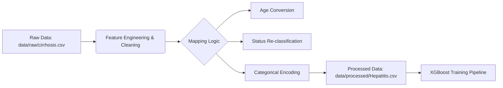

# AiLDS: AI Liver Disease Diagnosis System

This repository hosts a multi-stage diagnostic framework dedicated to evaluating the progression of **Liver Fibrosis** and predicting the probability of critical complications (Ascites) and mortality. The system relies on an ensemble of **XGBoost** training models, with its core logic distributed across three specialized files: `hepatitis_stage.pkl`, `hepatitis_complications.pkl`, and `hepatitis_status.pkl`. The model analyzes clinical input values based on "weights" acquired during the training phase, allowing for a precise determination of the risk level associated with each biomarker.

---

### Dataset Overview

| Name | Database Location | Function |
| --- | --- | --- |
| **hepatitis_stage.pkl** | `models/` | Trained model to classify histological damage (Stage 1-4). |
| **hepatitis_complications.pkl** | `models/` | Trained model to estimate the risk of Ascites. |
| **hepatitis_status.pkl** | `models/` | Trained model to calculate survival/mortality probability. |
| **train_hepatitis_models.py** | `code/` | Source code responsible for building and training the 3 models. |
| **test_hepatitis_models.py** | `code/` | Inference script for diagnosing the 7 cases (see details above). |
| **Hepatitis.csv** | `data/processed` | The processed clinical dataset derived from Mayo Clinic records. |
| **XGBoost.md** | `docs/` | Technical documentation explaining the mechanism of the XGBoost algorithm. |

---

### Training Phase

The system's efficiency depends on a data split of **80% for training** and **20% for testing**, ensuring the model learns robust patterns without memorizing the data.

> **Technical Note:** This split is considered the "Golden Standard" for medical datasets. It prevents the model from "hallucinating" or suffering from Overfitting, ensuring that high-risk stages (Stage 4) are identified based on generalized pathological patterns rather than specific patient identifiers.

---
## Data Pipeline & Feature Engineering

### 1. Data Source (Raw Data)

The primary dataset is sourced from the **Cirrhosis Prediction Dataset** hosted on Kaggle (provided by *fedesoriano*), which originates from the renowned **Mayo Clinic** study on primary biliary cirrhosis (PBC).

* **Original Source:** [Kaggle: Cirrhosis Prediction Dataset](https://www.kaggle.com/datasets/fedesoriano/cirrhosis-prediction-dataset)
* **Raw File Path:** `data/raw/cirrhosis.csv`
* **Description:** Contains historical clinical data collected between 1974 and 1984.

### 2. Feature Engineering Logic

To prepare the raw data for the **XGBoost** model, a rigorous **Data Engineering** phase was executed. The original file (`cirrhosis.csv`) was transformed into the processed training file (`Hepatitis.csv`) located in `data/processed`, resulting in a refined dataset of **419 patient records**.

The following transformations were applied:

#### **A. Target Variable Transformation (Status)**

The goal was to predict specific mortality risk. The original multi-class status was mapped to a binary format:

* **Original Values:**
* `C` (Censored) & `CL` (Censored due to Liver Transplant)  Considered **Stable**.
* `D` (Death)  Considered **Critical Event**.


* **Engineering Logic:**
```python
Status = { 'C': 0, 'CL': 0, 'D': 1 }  # 0: Alive/Stable, 1: Deceased

```


#### **B. Clinical Feature Encoding**

Categorical text values were converted into numerical formats to ensure mathematical compatibility with the model:

| Feature | Transformation Logic | Rationale |
| --- | --- | --- |
| **Age** | `Days / 365.25` | Converted from raw days to **Years** for clinical interpretability. |
| **Sex** | `M`  `1`, `F`  `0` | Binary encoding. |
| **Ascites** | `Y`  `1`, `N`  `0` | Presence vs. Absence. |
| **Hepatomegaly** | `Y`  `1`, `N`  `0` | Liver enlargement indicator. |
| **Spiders** | `Y`  `1`, `N`  `0` | Spider angiomas indicator. |

#### **C. Ordinal Severity Scaling (Edema)**

Unlike binary features, Edema has graduated severity levels. We applied **Ordinal Encoding** to reflect the increasing risk:

* **`N` (No Edema):** Mapped to **0.0**
* **`S` (Slight Edema):** Mapped to **0.5** (Edema resolvable with diuretics)
* **`Y` (Severe Edema):** Mapped to **1.0** (Edema resistant to diuretics)

---

### **Summary of Data Flow**


---

### 2- Model Input Requirements

To ensure result accuracy, data must be entered in the strict mathematical order used during the inference phase:
`['Bilirubin', 'Cholesterol', 'Albumin', 'Copper', 'Alk_Phos', 'SGOT', 'Tryglicerides', 'Platelets', 'Prothrombin', 'Age', 'Sex', 'Ascites', 'Hepatomegaly', 'Spiders', 'Edema']`

*Note: The `Status` model appends the predicted `Stage` to this list automatically.*

---

### Optimized Model Configuration

The following parameters were identified as the **"Gold Standard"** for this specific dataset to achieve maximum stability across the three models:

```python
# The optimized XGBoost configuration for Medical Diagnosis
model = xgb.XGBClassifier(
    n_estimators=100,      # Balanced number of trees to prevent complexity
    learning_rate=0.1,     # Optimal step size for stable convergence
    max_depth=3,           # Strategic depth to ensure high generalization
    subsample=0.8,         # Trains on 80% of data per tree to boost robustness
    eval_metric='logloss'  # Standard evaluation metric for binary classification
)

```

> **Scientific Insight:** In medical diagnostics, a `max_depth` of **3** is crucial. It forces the model to make decisions based on the most dominant biomarkers (like Bilirubin and Prothrombin) rather than creating complex, unexplainable branches that might fit noise in the data.

---

### 4. Virtual Clinic Test Results

To demonstrate the practical application of the model, a **"Virtual Clinic"** simulation was conducted using 7 real-world scenarios. This phase validates the model's ability to distinguish between "Structural Damage" (Stage) and "Functional Failure" (Status).

### Virtual Case Analysis Table

| Clinical Case | Brief Description | AI Stage | Survival Risk | Clinical Interpretation |
| --- | --- | --- | --- | --- |
| **1. The Healthy Reference** | Normal labs, no symptoms. | **Stage 1** | **1.4%** | Baseline reference for a low-risk profile. |
| **2. Acute Inflammation** | High Bilirubin (3.2), Stage 2. | **Stage 2** | **97.2%** | **Critical:** High mortality despite moderate fibrosis stage. |
| **3. Early Fibrosis** | Moderate APRI score. | **Stage 3** | **2.7%** | Disease is progressing but functionally stable. |
| **4. Compensated Cirrhosis** | Stage 4, but normal Albumin. | **Stage 4** | **0.6%** | **Key Result:** Successful clinical compensation (Type CL). |
| **5. Decompensated Failure** | Stage 4 + Ascites + Low Albumin. | **Stage 4** | **99.9%** | End-stage liver failure; immediate intervention required. |
| **6. Active Injury** | Stage 4 with high Enzymes (SGOT). | **Stage 4** | **92.5%** | High risk due to ongoing active inflammation. |
| **7. The Geriatric Case** | Age 70, Coagulation issues. | **Stage 4** | **98.9%** | Demonstrates the compounded risk of Age + Fibrosis. |

---

### Clinical Insights

Based on the Virtual Clinic outputs, critical technical observations regarding the AiLDS logic were derived:

#### **A. The "Compensated" Paradox (Case 4)**

The model successfully identified a patient with **Stage 4 Cirrhosis** yet assigned a very low mortality risk (**0.6%**). This reflects the clinical reality of "Compensated Cirrhosis," where the liver is scarred but still functional. This aligns with the "CL" (Censored/Transplant) data logic, proving the model is not blindly equating Stage 4 with Death.

#### **B. The Lethality of Bilirubin (Case 2)**

The model assigned a **97% risk** to a Stage 2 patient due to elevated Bilirubin (3.2). This confirms that **XGBoost** has correctly prioritized "Functional Markers" over "Structural Stage" when predicting immediate mortality.

#### **C. Multi-Factor Integration**

In Case 5, the convergence of **Ascites**, **Low Albumin**, and **High Copper** pushed the risk to **99.9%**, demonstrating the model's ability to handle complex, multi-variable failure cascading.
