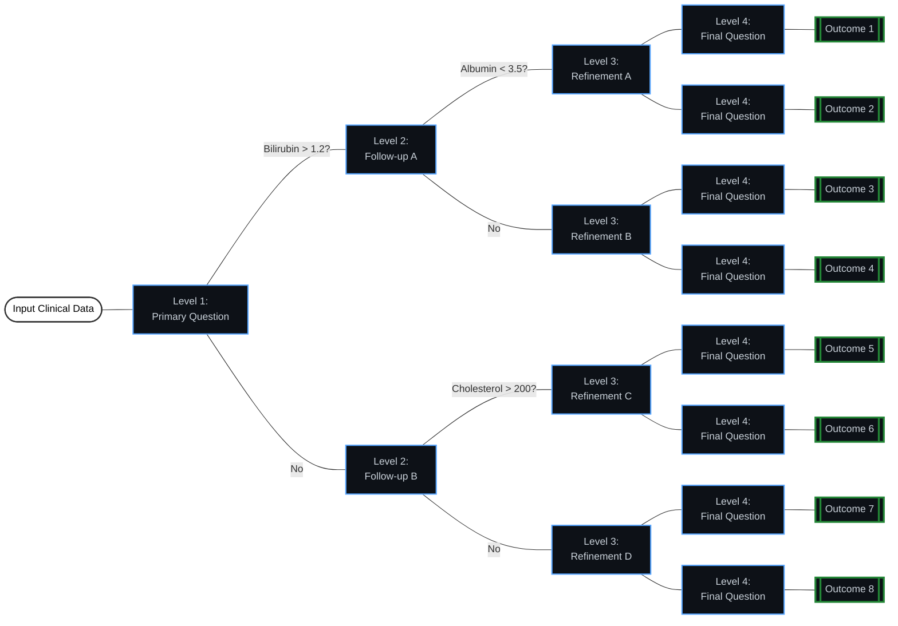
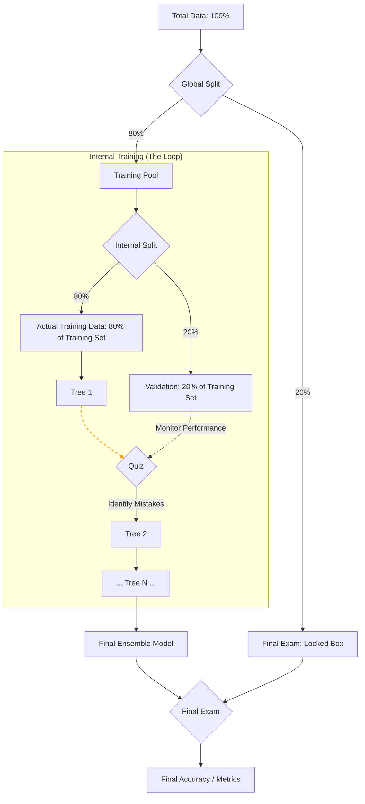

# **XGBoost Algorithm Overview**

XGBoost (eXtreme Gradient Boosting) is the core engine used in this project for analyzing medical data. Unlike standard AI models that might try to guess an outcome in a single attempt, XGBoost adopts a smarter, sequential approach akin to a team of doctors analyzing a patient's file one by one. In this analogy, the first tree makes an initial diagnosis, the second tree identifies and corrects the first one's mistakes, and the third focuses exclusively on the remaining errors. This process repeats hundreds of times, and the final result is a combination of all these "opinions," leading to a highly accurate prediction.

The power of this model lies in Gradient Boosting, a technique that builds many simple trees in a sequence rather than creating one giant, complex tree.  The process begins by building a Decision Tree to predict a target, such as Cancer Risk, followed by calculating the error—the difference between that prediction and the actual value. A new Decision Tree is then constructed specifically to fix that error and is added to the model. This cycle ensures that every new tree addresses previous flaws, making the model progressively smarter than it was before.

---

## **Deep Dive**

Before diving into the technical details of our XGBoost configuration, it is essential to address the core challenge of **Overfitting**.

Overfitting occurs when an AI model memorizes the specific details and noise within the training data instead of learning the underlying general patterns.

> **The Student Analogy:**
> Imagine a student who memorizes previous exam questions word-for-word rather than understanding the core mathematical concepts. If a new question appears—even one with the same logic but different phrasing—the student will fail to answer because they "memorized" without "understanding."

**Why this matters in Medical Diagnostics** because in our project for diagnosing diseases, we must avoid this at all costs. The model needs to be a thinker, not a memorizer. It must be able to generalize its diagnostic logic to **new patients** it has never encountered before, ensuring stable and reliable clinical predictions rather than simply echoing the specific cases found in the training dataset.

To ensure our XGBoost model remains a smart learner, we implemented the following constraints:

### **Decision Tree Architecture (max_depth=4)**

1. Tree Depth (max_depth=4): This constraint prevents the model from growing overly complex trees that might capture "noise" or specific outliers in the training data, ensuring that the model focuses on broader, more significant clinical patterns. This is **illustrated** by the maximum depth of four shown in the **Architecture & Logic Schematics (1)** at the end of the page.

2. StStochastic Data Sampling (subsample=0.8): During training, the model only sees a random 80% of the dataset for each tree. This variation forces the model to find robust patterns that work for the entire dataset, rather than just memorizing a specific group of patient records. This process is illustrated in the **Architecture & Logic Schematics (2)** at the end of the page, which shows the internal 80/20 split used during the learning process.

L1 & L2 Regularization: The model applies mathematical penalties to over-complex structures. L1 (Lasso) encourages sparsity by potentially zeroing out less important features, while L2 (Ridge) prevents any single feature from having an extreme influence. Together, they ensure better generalization, allowing the model to perform accurately on new, unseen patient data.


3. **Data Sampling (`subsample=0.8`):** The model trains on different subsets of the data, forcing it to find robust patterns that exist across the entire dataset.
4. The model applies L1 and L2 regularization to penalize over-complex trees and ensure better generalization.

<div align="center">
  <hr style="width: 100%; border: none; height: 0.4px; background-color: rgba(255, 255, 255, 0.3);">
</div>


Below is a detailed breakdown of the internal mechanisms that make XGBoost superior for this medical diagnostic project:

### **1. Regularization**
Prevents overfitting, unlike standard Gradient Boosting, which focuses solely on minimizing the error (Loss Function), XGBoost optimizes an objective function that includes a **regularization term**.

$$Obj(\Theta) = L(\Theta) + \Omega(\Theta)$$


* **$$L(\Theta)$$ (Loss):** Measures how well the model fits the training data.
* **$$Omega(\Theta)$$ (Regularization):** Measures the complexity of the trees.
It applies **L1 (Lasso)** and **L2 (Ridge)** regularization. In simple terms, this "penalizes" the model if the trees become too complex or rely too heavily on specific features. This is critical in our medical dataset to ensure the diagnosis logic applies to *new* patients, not just the training group.

### **2. Sparsity Awareness**

Medical data often contains missing values (e.g., a patient didn't take a specific lab test).

* XGBoost treats "missing values" as information, not errors. During training, the algorithm learns a **"Default Direction"** for each node in the tree.
* If a future patient has a missing value for a specific test, the model automatically sends them down the "default path" that was statistically determined to minimize error during training. This removes the need for complex imputation techniques (like filling with averages) which can sometimes introduce noise.

### **3. Parallel Processing**

While Boosting is inherently sequential (Tree 2 must wait for Tree 1), XGBoost achieves speed through **Parallel Feature Splitting**.

* The most time-consuming part of building a tree is sorting data to find the best "split point." XGBoost stores the data in compressed, pre-sorted columns (Block Structure).
* This allows the algorithm to use multiple CPU cores to search for the best split points simultaneously. This makes training significantly faster than traditional methods like sklearn's GBM.

### **4. Tree Pruning**

Traditional algorithms use a "greedy" approach, stopping the tree growth as soon as a split yields negative gain. This can be problematic if a "bad" split leads to a "very good" split later on.

* If a branch has a negative gain but is followed by a highly positive gain, XGBoost keeps it. If the total gain is negative after checking the full depth, it removes (prunes) the branch.


---

## **Models Training Strategy** Validation Set

To ensure the system acts as a "Smart Clinician" rather than a "Rote Learner," I implemented a strict data separation and feature dropping protocol. This prevents the model from "cheating" by seeing the answers or irrelevant metadata during the learning phase.

### **1. The 80/20 Validation Framework**

* **80% Training Set:** Acts as the "Academic Curriculum," where the XGBoost algorithm learns complex patterns between biomarkers.
* **20% Testing Set:** Acts as the "Unseen Exam." These records are hidden from the model during training to measure its real-world diagnostic accuracy.


### **2. Maximizing Data Utility**

While the standard 80/20 split was used for validation, a strategic decision was made to **retrain** the following models on the **100% full dataset** before final deployment. This approach was specifically chosen for the models that faced the highest complexity in clinical pattern recognition.

#### **Performance-Driven Retraining Logic**

| Model File | Accuracy (Validation) | Reliability Status | Strategic Action |
| --- | --- | --- | --- |
| `hepatitisC_stage_model.pkl` | **62.50%** | **Academic Use** | Full Dataset Integration |
| `hepatitisC_status_model.pkl` | **71.43%** | **Moderate-High Reliability** | Full Dataset Integration |

### **Why 100% Data was used for these specific models?**

1. The analytical values for different stages and statuses in these datasets were significantly close and overlapping. In such "high-proximity" data environments, the model needs to see every possible variation to establish a more stable decision boundary.
2. Because these models showed lower initial confidence (62.50% and 71.43%), withholding 20% of the data for testing in the final version would have meant losing valuable clinical cases. By merging the test set back into the training phase, we provided the XGBoost engine with the **maximum possible knowledge base**.
3. **Real-World Deployment Readiness:** To ensure the system performs reliably in a real clinical setting without "missing" subtle patterns, utilizing the full training file was essential. This ensures that no potential diagnostic insight from the original dataset is wasted.
---
## **Data Leakage**

**Data Leakage** occurs when information from outside the training dataset is used to create the model. This essentially allows the model to "cheat" during the training process by having access to data that would not be available at the time of a real-world prediction. While the model may show near-perfect accuracy (e.g., 100%) during testing, it will fail to provide accurate results or even fail entirely when applied to new real-world patients.


* During the development of the **Complications Prediction Model*** `hepatitisC_complication.pkl`, I intentionally excluded the 'Stage' column from the feature set to prevent Data Leakage. In clinical practice, there is a near-perfect correlation between advanced liver disease (Stage 4/Cirrhosis) and the presence of Ascites (fluid retention). If 'Stage' were included as an input, the model would likely ignore complex biomarkers—such as Bilirubin and Albumin—to follow a simplistic shortcut: "If Stage is 4, then Ascites is present." By removing this "answer key," the model is forced to identify deep physiological patterns within raw laboratory data. This ensures the model remains a pure predictive tool based on blood analytics, capable of providing truly objective risk assessments even before a patient’s histological stage is formally diagnosed.

---

### **Feature Selection & Dropped Columns**

Each of the six models within the ecosystem Went through a rigorous feature selection process. Columns that could lead to Data Leakage (where the answer is hidden in the features) were intentionally removed:

| Model Name | Training Dataset | Dropped Columns | Technical Justification |
| --- | --- | --- | --- |
| **1. Gate Model** | `Liver_Patient_Dataset...` | **Target Label** | Separating the final diagnosis from features to ensure honest pattern recognition. |
| **2. Cancer Risk** | `The_Cancer_data_1500.csv` | **Diagnosis** | Primary target removal to prevent the model from seeing the answer key. |
| **3. Complications** | `HepatitisC.csv` | **ID, N_Days, Status, Stage** | IDs are random noise; `Status/Stage` provide direct hints (leakage) about Ascites risk. |
| **4. Staging Model** | `hepatitisC_Stage.csv` | **Stage** | Removed the stage column as it is the target variable for multi-class classification. |
| **5. Status Model** | `hepatitisC_status.csv` | **Status, Stage** | Stage is the answere, and `Stage` has been removed because it is one of the Hepatitis C 3-Models requirement. |
| **6. Fatty Liver** | `FattyLiver.csv` | **Diagnosis, SEQN** | `SEQN` (Patient Sequence) is metadata; its removal forces the model to focus only on ALT/GGT/Triglycerides. |


### **Why These Columns Were Dropped?**

1.  By removing these columns, the XGBoost engine is forced to discover the genuine mathematical relationships between biomarkers (such as **Albumin** and **Bilirubin**) and medical outcomes, rather than relying on a direct answer provided within the data.
2. If identifiers are left in, the model might associate a specific row or metadata with a disease. This causes **Data Leakage**—similar to giving a student the answer in the margin of an exam. While this leads to 100% training accuracy, it causes total failure with new patients. forcing the models to analyze **Raw Blood Chemistry** instead of memorizing previous diagnoses.

---

### **Why Is This Dangerous?**

1. **False Confidence:** You may believe you have developed a revolutionary model due to high accuracy scores.
2. **Deployment Failure:** In a real clinical setting, a doctor uses the model specifically because they *do not yet know* the stage of the patient's disease. Since the "cheating" feature (Stage) is missing, the model's performance will collapse.

> **Key Takeaway:** To ensure a model is truly predictive, we must remove any features that are "outputs" of the disease or are only determined after the target condition has already developed.

---

### **Projects Technical Implementation**

#### 1- Data Balancing Strategy

In medical diagnostics, datasets are often heavily skewed, instance, the number of patients diagnosed with **Ascites** is significantly lower than healthy individuals. A standard model would likely develop a "Majority Bias," predicting everyone as healthy to achieve high accuracy while failing to detect actual cases.

**The Solution:**
Instead of manual oversampling, we implemented a dynamic class-weighting mechanism. The code programmatically calculates the ratio between the two classes (On: `data/raw/Liver_Patient_Dataset_Cleaned_19k.csv` file) to determine the `scale_pos_weight` parameter:

 By assigning a higher weight to the minority class (the patients), the **XGBoost** algorithm becomes hyper-sensitive to positive cases. It forces the loss function to penalize the misclassification of a **sick** patient more heavily than a **healthy** one, ensuring the model is clinically reliable.

* **Implementation:** This logic is fully automated in `code/train_gate_model.py` and demonstrated in this [Google Colab Notebook](https://colab.research.google.com/drive/1sr0GzN9SEN2H5wC3t0REaPVXUMlFYzfG#scrollTo=OGcBn26-pcsQ).

---
#### 2- Cancer Risk Model
The Liver Cancer diagnostic model was specifically optimized to account for the Limited-scale Clinical Dataset used in this study. To ensure the model remains robust and reliable for sensitive cancer detection, the following configuration was implemented:

* Tree Depth Constraint (max_depth = 3): With a constrained sample size, deep trees (high max_depth) pose a high risk of Overfitting, where the model captures noise and specific outliers rather than generalized medical patterns. By restricting the depth to 3, we ensured that the XGBoost algorithm focuses on the most prominent and statistically significant diagnostic features.

* This approach achieved the highest Validation Accuracy by promoting model simplicity. It prevented the algorithm from "memorizing" individual patient cases, ensuring that the diagnostic logic is stable and can be generalized to new clinical samples effectively.
---
## **Automated Hyperparameter Tuning**

To achieve the highest diagnostic accuracy, we utilize an exhaustive **Grid Search** approach within the Google Colab environment. This process automates the selection of optimal settings for the XGBoost algorithm.

### **Mathematical Search Space**
The algorithm evaluates every possible combination of parameters defined in the `param_grid`. Based on our current configuration:
```
# --- Example ---
# --- Defining Hyperparameters ---

param_grid = {
    'n_estimators': [100, 300, 500],
    'learning_rate': [0.01, 0.05, 0.1],
    'max_depth': [3, 4, 5],
    'subsample': [0.8, 1.0]
}
```

* **n_estimators**: 3 values [100, 300, 500]
* **learning_rate**: 3 values [0.01, 0.05, 0.1]
* **max_depth**: 3 values [3, 4, 5]
* **subsample**: 2 values [0.8, 1.0]

**Total Unique Combinations** = $3 \times 3 \times 3 \times 2 = 54$ combinations.
Since we apply **5-fold Cross-Validation** (`cv=5`), each combination is trained 5 times on different data subsets. 
**Total Training Iterations** = $54 \times 5 = 270$ individual fits.

> To see more about Automated Hyperparameter Tuning strategy : [](https://colab.research.google.com/drive/1sr0GzN9SEN2H5wC3t0REaPVXUMlFYzfG#scrollTo=TCOPEuAyyDg-)

<p align="center">  </p>

## **Architecture & Logic Schematics**

### **1. Decision Tree Architecture (max_depth=4)**


---
### 2. Random Sampling & Self-Testing


---


